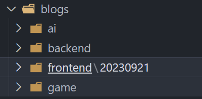
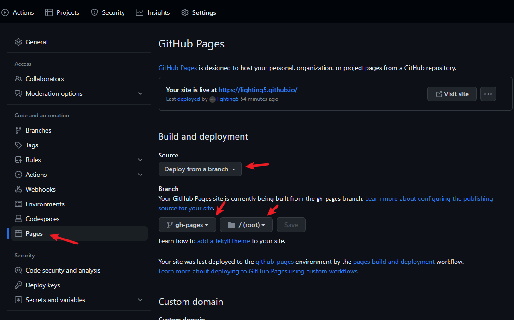

## 1、前言

俗话说的好：好记性不如烂笔头。做技术的，有自己的一个博客网站，不仅可以记录自己的学习笔记，分享自己的技术文章，还可以和志同道合的开发者交流，何乐而不为呢？
那么如何简单高效 diy 一个自己的博客网站呢？VuePress 就是一款非常优秀的静态网站生成器，它基于 Vue 构建，以 Markdown 为中心的项目结构，以最少的配置帮助你专注于写作。
简单来说，只要你配置好项目后，就可以直接写 Markdown 文档，然后生成静态网站，部署到 Github、Gitee、Coding 等静态网站托管平台，就可以直接访问了。

## 2、技术选型

[这个是 VuePress 的官方文档](https://v2.vuepress.vuejs.org/zh/guide/)，有兴趣深挖 VuePress 配置信息的同学可以过一遍文档。官方也给出了选择 VuePress，而不是 Nuxt、VitePress、GitBook 等其他工具的理由。
另外，如果是使用 VuePress 的默认主题的话，可能还是会让博客看起来比较单调，所以这里推荐使用[vuepress-theme-reco](https://vuepress-theme-reco.recoluan.com/)，一个基于 VuePress 2.x 的主题，这个主题插件看起来还是挺好看的，今天就以这个主题为例，来手把手教大家如何搭建一个属于自己的博客网站。

## 3、安装配置

### 快速开始

安装 vuepress-theme-reco，官方给出了三种方式：

**npx**

```bash
# 初始化，并选择 2.x
npx @vuepress-reco/theme-cli init
```

**npm**

```bash
# 初始化，并选择 2.x
npm install @vuepress-reco/theme-cli@1.0.7 -g
theme-cli init
```

**yarn**

```bash
# 初始化，并选择 2.x
yarn global add @vuepress-reco/theme-cli@1.0.7
theme-cli init
```

这里我选择第一种方式

1. 先新建一个文件夹命名 vuepress。
2. 进入 vuepress 文件夹，执行命令 `npx @vuepress-reco/theme-cli init` 选择 2.x 版本。


3. 用 vscode 打开项目， `npm install`安装依赖，然后 `npm run dev`启动项目，可以看到，项目是用 vite 来构建的。


### 自定义配置

项目的文件目录如下：


- .vuepress 是 vuepress 的配置目录
- blogs 是放置博客目录
- docs 是放置文档目录

**README.md 是首页,这边可以修改成自己的信息**

```md{10-21}
---
home: true
modules:
  - BannerBrand
  - Blog
  - MdContent
  - Footer
bannerBrand:
  bgImage: '/bg.svg'
  title: 码无止境的世界
  description: Code is Life
  tagline: 在无止境的编程代码世界里遨游，用代码改变我们的生活。
  buttons:
    - { text: 进入, link: '/categories/qianduan/1/' }
  socialLinks:
    - { icon: LogoGithub , link: 'https://github.com/LeeyCul' }
blog:
  socialLinks:
    - { icon: LogoGithub , link: 'https://github.com/LeeyCul' }
    - { icon: LogoWechat , link: '/docs/wechat' }
isShowTitleInHome: true
actionText: About
actionLink: /views/other/about
---
```

首页效果如下：


config.ts 配置修改

```js{15-18}
import { defineUserConfig } from "vuepress";
import recoTheme from "vuepress-theme-reco";

export default defineUserConfig({
  title: "码无止境 Code is Life",
  description: "在无止境的编程代码世界里遨游，用代码改变我们的生活",
  theme: recoTheme({
    style: "@vuepress-reco/style-default",
    logo: "/logo.png",
    author: "码无止境",
    authorAvatar: "/logo.png",
    lastUpdatedText: "",
    navbar: [
      { text: "指南手册", link: "/docs/handbook/getting-started",icon: 'Compass'  },
      { text: "博客", link: "/categories/qianduan/1/",icon: 'DocumentAttachment' },
      { text: "工具", link: "/categories/tools/1/",icon: 'SubVolume' },
      { text: '留言板', link: '/docs/message-board', icon: 'Chat' },
    ],
  }),
});


```

**开始写文章啦~~**

1. 首先在 blogs 目录下创建你自己分类的文件夹

   

2. 我这边按类别向下按日期分类文章

   

::: tip
文章中用到的图片，只需要截图后粘贴进 markdown 文档中，会自动将图片放置到同级目录的 image 文件夹下。
另外，在 vscode 中写 markdown 文档，用下面这些 vscode 扩展就可以更加愉快高效地写作。


:::

3. 每篇文章的开头都是以---和---包裹的文章头，其中 tags 定义好后，vuepress 会自动根据你的 tag 进行文章标签分类，categories 则会根据类别整理文章。
   > 这边如果分类名称是中文的话，在 config.ts 中定义 link 时候就是按照中文拼音来定义的，可以看上面的 config 代码块中的高亮代码部分 ☝️

文章分类页面如下


至于怎么写好 Markdown 文档，可以参考[VuePress 官网关于 Markdown 的介绍](https://v2.vuepress.vuejs.org/zh/guide/markdown.html)


## 4、部署上线

基本上我们的博客已经搭建完成了，接下来就是部署上线了，可以使用 Github Pages，免费让我们的博客上线。

1. 首先，在 Github 上创建一个仓库，仓库名用你的用户名+github.io: `<USERNAME>.github.io`


::: tip
如果你访问 github 很慢的话，可以参考这里 [Github 访问速度太慢？一个小工具就够了！](/blogs/tools/20230923)
:::

2. 然后，将你的仓库克隆到本地，再将你的 vuepress 项目拷贝到仓库根目录下，然后将仓库推送到 github 的 master 主分支上。
3. 另外还需要创建另一个分支`gh-pages`用来发布博客静态页面，可以在你的项目根目录下新建 deploy.sh 脚本，内容如下：

```sh
  # 确保脚本抛出遇到的错误
  set -e

  # 生成静态文件
  npm run build

  # 进入生成的文件夹
  cd .vuepress/dist


  git init
  git add -A
  git commit -m 'deploy'

  # 如果发布到 https://<USERNAME>.github.io
  # git push -f git@github.com:<USERNAME>/<USERNAME>.github.io.git master

  # 如果发布到 https://<USERNAME>.github.io/<REPO>
  # git push -f git@github.com:<USERNAME>/<USERNAME>.github.io.git master:gh-pages
  # 我的配置如下
  git push -f https://github.com/lighting5/lighting5.github.io.git master:gh-pages

  cd -
```

> 打开项目文件位置，右键用 git bash 执行 deploy 脚本，将本地项目推送到 github 的 gh-pages 分支。


```sh
#执行部署脚本
./deploy.sh
```

4. 在 Github 仓库的设置 Settings 中找到 Pages，修改相应配置后，点击 Save。

   

这样每次执行 deploy 脚本后，github 的 Actions 会自动执行部署工作流，你的博客页面就会自动更新了。


5. 成功部署后就可以访问你的个人博客了，访问地址就是 `<USERNAME>.github.io`。

我的已经成功上线了，欢迎围观！😃 [https://github.com/LeeyCul/](https://github.com/LeeyCul/)

**完结撒花 🎉🎉🎉**
